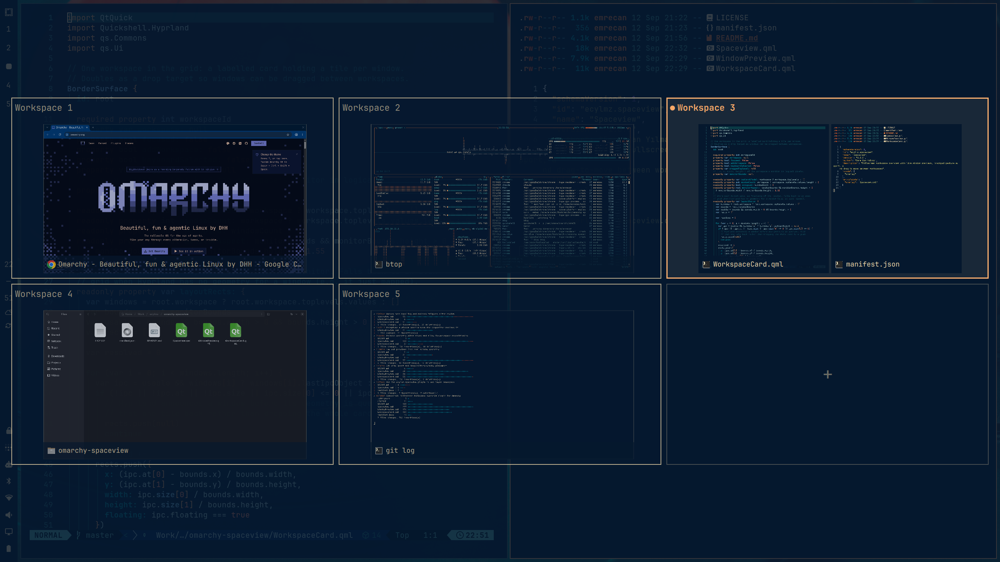

# Spaceview

A fullscreen workspace overview for [Omarchy](https://omarchy.org/): every workspace
side by side, every window a live preview. Built as an `omarchy-shell` plugin, so it
runs inside the shell you already have — no compositor plugin, no compiling, nothing
to rebuild when Hyprland updates.

Designed for the trackpad: swipe up with three fingers to open, swipe down to close.



## Features

- Fullscreen grid of all workspaces, sized to fit your screen
- Each card is a true miniature of the workspace: windows are placed from
  Hyprland's own geometry, so a vertical split reads as a vertical split
- Live Wayland window previews (`ScreencopyView`), with the app icon as a fallback
- Three-finger trackpad gestures that fire the moment the swipe is recognized,
  not when your fingers lift
- Click a window to focus it, click a workspace to switch to it
- Drag a window to another workspace: the preview rides along with the pointer,
  and dropping it on the left, right, top, or bottom half of an existing window
  places it exactly there — the landing zone is highlighted while you drag
  (dwindle only; it uses `layoutmsg preselect`). Drop it on empty space in the
  card to let the layout decide
- Rearrange a workspace without leaving it: drop a window on a side of one of
  its own neighbours to turn a vertical split into a horizontal one, and the
  cards re-read Hyprland's geometry as soon as anything moves
- Keyboard navigation: arrows or `hjkl`, `Enter`/`Space` to activate, `1`–`9`/`0`
  to jump straight to a workspace, `Esc` to close
- A trailing `+` card that takes you to the next empty workspace
- Styling comes entirely from Omarchy theme tokens, so it follows `omarchy theme set`

## Requirements

- Omarchy 4 (Quattro) with `omarchy-shell`
- Hyprland with the Lua configuration format (Omarchy 4 default) for the gesture setup
- Quickshell 0.3+ with the Wayland screencopy module (ships with Omarchy)

No external binaries, services, or network access.

## Install

```bash
omarchy plugin add https://github.com/ecylmz/omarchy-spaceview.git --enable --yes
```

Verify it is there:

```bash
omarchy plugin list | grep spaceview
omarchy-shell shell toggle ecylmz.spaceview
```

## Open it with a trackpad gesture

Add this to `~/.config/hypr/input.lua`:

```lua
-- Three fingers up opens Spaceview, three fingers down closes it.
-- The table form fires on `start`, i.e. as soon as the swipe is recognized;
-- a bare `action = function() ... end` would only fire once your fingers lift.
local spaceview = function(command)
  return {
    start = function()
      hl.exec_cmd("omarchy-shell shell " .. command .. " ecylmz.spaceview")
    end,
    update = function() end,
    finish = function() end,
  }
end

hl.gesture({ fingers = 3, direction = "up", action = spaceview("summon") })
hl.gesture({ fingers = 3, direction = "down", action = spaceview("hide") })
```

Then `hyprctl reload`.

## Open it with a key binding

Add this to `~/.config/hypr/bindings.lua`:

```lua
o.bind("SUPER + G", "Workspace overview", "omarchy-shell shell toggle ecylmz.spaceview")
```

## Keys

| Key | Action |
| --- | --- |
| Arrows / `h` `j` `k` `l` | Move between workspace cards |
| `Enter` / `Space` | Switch to the selected workspace |
| `1`–`9`, `0` | Switch to that workspace directly |
| `Esc` | Close |

## Remove

```bash
omarchy plugin remove ecylmz.spaceview --yes
```

Then delete the `hl.gesture(...)` block from `~/.config/hypr/input.lua` (or the
binding from `~/.config/hypr/bindings.lua`) and run `hyprctl reload`.

## Credits

The grid, card, and preview layout started from the workspace overview proposed in
[omacom/omarchy#6611](https://github.com/omacom/omarchy/pull/6611) by
[@sanjyay](https://github.com/sanjyay), which was closed rather than merged. That
code is MIT licensed as part of Omarchy. Spaceview reworks it into a standalone
third-party plugin: Lua-form Hyprland dispatches, gesture-driven summoning, a
reworked focus hierarchy, and a deeper scrim for fullscreen use.

## License

MIT — see [LICENSE](LICENSE).
